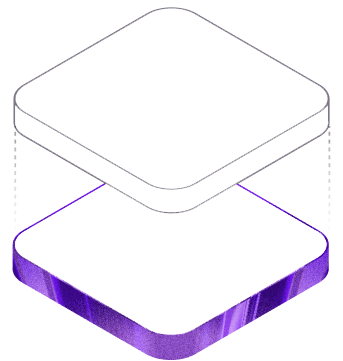

# Melodia 🎵 - AI-Powered Music Streaming

Melodia is a full-stack, AI-powered music streaming application that leverages artificial intelligence to create perfectly curated playlists, personalized music discovery, and seamless audio playback.



## ✨ Features

- **AI Playlist Generation**: Ask the AI (powered by Gemini) for a mood, genre, or activity, and it will instantly curate a custom playlist just for you.
- **Modern Music Player**: A fully featured audio player with play, pause, skip, seek, and volume control capabilities.
- **Firebase Authentication**: Secure user login, signup, and session management.
- **Dynamic Explore Section**: Discover trending tracks, new releases, and personalized recommendations.
- **Responsive Design**: Beautiful, glassmorphic UI that looks great on mobile, tablet, and desktop devices.
- **Full-Stack Architecture**: A robust Node.js/Express backend connected to a MongoDB database.

## 🛠 Tech Stack

**Frontend:**
- React (Vite)
- Tailwind CSS
- Redux Toolkit (State Management)
- Firebase (Authentication)

**Backend:**
- Node.js & Express
- MongoDB (Mongoose)
- Google Gemini API (AI integration)
- YouTube API (Audio data)
- Spotify API (Metadata)

## 🚀 Installation

1. **Clone the repository:**
   ```bash
   git clone https://github.com/lakshitaisrani/melodia-ai-music-streaming.git
   cd melodia-ai-music-streaming
   ```

2. **Install Frontend Dependencies:**
   ```bash
   cd client
   npm install
   ```

3. **Install Backend Dependencies:**
   ```bash
   cd ../server
   npm install
   ```

## 🔐 Environment Variables

The project uses `.env` files for both the client and server. Please copy the example files and fill in your own keys:

**Client Setup (`client/.env`)**
Copy `client/.env.example` to `client/.env` and add your Firebase config keys:
```env
VITE_FIREBASE_API_KEY=your_firebase_api_key
VITE_FIREBASE_AUTH_DOMAIN=your_auth_domain
VITE_FIREBASE_PROJECT_ID=your_project_id
...
```

**Server Setup (`server/.env`)**
Copy `server/.env.example` to `server/.env` and add your backend keys:
```env
PORT=5000
MONGODB_URI=your_mongodb_connection_string
YOUTUBE_API_KEY=your_youtube_v3_api_key
GEMINI_API_KEY=your_google_gemini_api_key
...
```

> **Note:** Never commit your `.env` files or API keys.

## 🏃 How to Run

You can run the application concurrently using the `start.bat` script, or manually start each server:

**Run the Backend:**
```bash
cd server
npm start
```

**Run the Frontend:**
```bash
cd client
npm run dev
```

The app will be accessible at `http://localhost:5173`.

## 📂 Folder Structure

```
melodiaa/
├── client/              # Frontend React application
│   ├── src/             # React components, pages, context, styles
│   ├── public/          # Static assets
│   └── .env.example     # Frontend environment variables template
├── server/              # Backend Node.js/Express application
│   ├── controllers/     # API route logic
│   ├── models/          # MongoDB schemas
│   ├── routes/          # Express route definitions
│   └── .env.example     # Backend environment variables template
└── start.bat            # Script to run both servers simultaneously
```

## 🔮 Future Improvements

- Offline playback support
- Social sharing and collaborative playlists
- Advanced audio equalizer and crossfade
- Admin dashboard for content management

## 📄 License

This project is licensed under the [MIT License](LICENSE).
